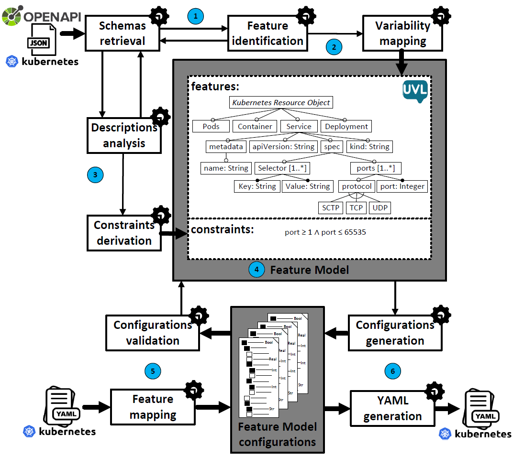

# Table of Contents

- [Table of Contents](#table-of-contents)
- [k8sJsontoUvl](#k8sJsontoUvl)
  - [Description](#description)
  - [How to use it](#how-to-use-it)
  - [Using the scripts](#using-the-scripts)
    - [Requirements](#requirements)
    - [Download and install](#download-and-install)
    - [Execution](#execution)
  - [Architecture and repository structure](#architecture-and-repository-structure)
  - [Validation data and supplementary material](#validation-data-and-supplementary-material)
  - [References and third-party tools](#references-and-third-party-tools)

---

# k8sJsontoUvl
[](https://doi.org/10.5281/zenodo.17879567)

Repository for the project **Automated Synthesis of Kubernetes Variability from OpenAPI Schemas**



## Description

**k8sJsontoUvl** is an automated pipeline for extracting a variability model from Kubernetes’ OpenAPI JSON schemas. It produces a [UVL (Universal Variability Language)](https://universal-variability-language.github.io/) feature model representing configuration options and their constraints.

The pipeline includes:
- Schema parsing and property mapping
- Rule-based constraint generation
- UVL model synthesis
- YAML-to-feature mapping and configuration validation using [Flamapy](https://www.flamapy.org/)

It is designed for research, analysis, and validation scenarios where formal modeling of complex system configurations (like Kubernetes) is required.

---

## How to use it

The usage involves two main steps:
1. Obtain a version of the Kubernetes `_definitions.json` schema (e.g., using the `scriptGetRepoVersion.sh`)
2. Run the main conversion script to generate the `.uvl` feature model

YAML configurations can then be mapped and validated against the model.

## Using the scripts

### Requirements

- [Python 3.9+](https://www.python.org/)
- [Flamapy](https://www.flamapy.org/)
- Git
- Bash or PowerShell for script execution

---

### Download and install

1. Install [Python 3.9+](https://www.python.org/)

2. Clone this repository and enter the project folder:
  ```bash
  git clone https://github.com/CAOSD-group/fm-json-kubernetes.git
  cd fm-json-kubernetes
  ```
3. Create a virtual environment:

  ```bash
  python -m venv env
  ```

4. Activate the environment:

  - **Linux:**
    ```bash
    source env/bin/activate
    ```
  - **Windows:**
    ```powershell
    .\env\Scripts\Activate
    ```

5. Install the dependencies:

  ```bash
  pip install -r requirements.txt
  ```

### Execution


To obtain the Kubernetes JSON schema, use the included script:

```bash
./scripts/scriptGetRepoVersion.sh
```

> ⚙️ Modify the version by changing the line:
> ```bash
> echo "v1.30.2" >> .git/info/sparse-checkout
> ```

Or dowload manually from https://github.com/yannh/kubernetes-json-schema

Then run the main feature model generator:

```bash
python scripts/model_generation/convert01.py
```

Make sure to update the path to the `_definitions.json` file at the bottom of the script:

```python
definitions_file = './resources/kubernetes-json-v1.30.2/_definitions.json'
```

#### Output files:


- `kubernetes_combined_04.uvl`: Final synthesized feature model.
- `descriptions_01.json`: Grouped and parsed feature descriptions used for constraint generation.


---

## Architecture and repository structure

The overall workflow is visualized below:


### Pipeline stages

- `convert01.py`: Parses JSON schemas and builds the UVL model.
- `mappingUVL.csv`: Maps YAML keys to UVL features.
- `mappingYAMLJSON.py`: Converts YAML files into JSON candidates for validation.
- `getStatisticsValid.py`: Run validation, configuration and generate result summaries.

### Key folders

- `/scripts/`: Scripts and main utilities.
- `/evaluation/`: Results data of evaluations.
- `/variability_model/`: Feature models results and diagrams.
- `/resources/`: Example Kubernetes schema inputs.

---

## Validation data and supplementary material

Due to GitHub storage limitations, the large dataset containing the original configuration files (manifests) used for validation is hosted permanently on Zenodo.
To reproduce the experiments described, follow these steps:

1.  **Download** the dataset from Zenodo:
    * **DOI:** [10.5281/zenodo.17879567](https://doi.org/10.5281/zenodo.17879567)
    * **Format:** `.zip` archive
2.  Use the script `premappingYaml01` for filter the manifests
3.  Use the script `mappingYAMLJSON.py` for convert the YAMLs files into a configuration JSON with compatibility with the Feature Model

We obtained a complete dataset of files with total compatibily with the FM of Kubernetes 


---

## References and third-party software

- [**Flamapy**](https://www.flamapy.org/): SPL analysis and validation framework  
- [**UVL: Universal Variability Language**](https://universal-variability-language.github.io/)  
- [**Kubernetes JSON Schemas**](https://github.com/yannh/kubernetes-json-schema)

---

_This project is in active development. Future improvements include more robust constraint integration, validation visualization, and support for additional formats._
